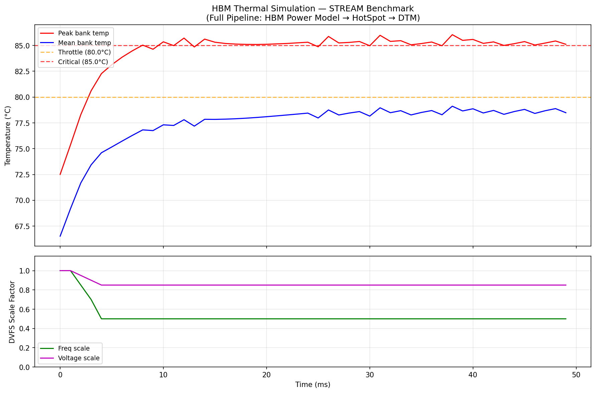
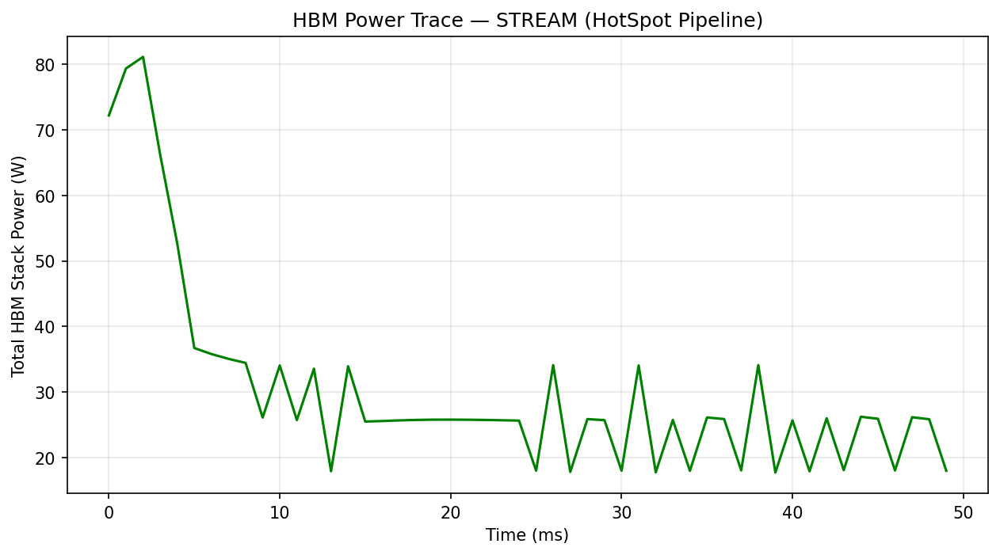
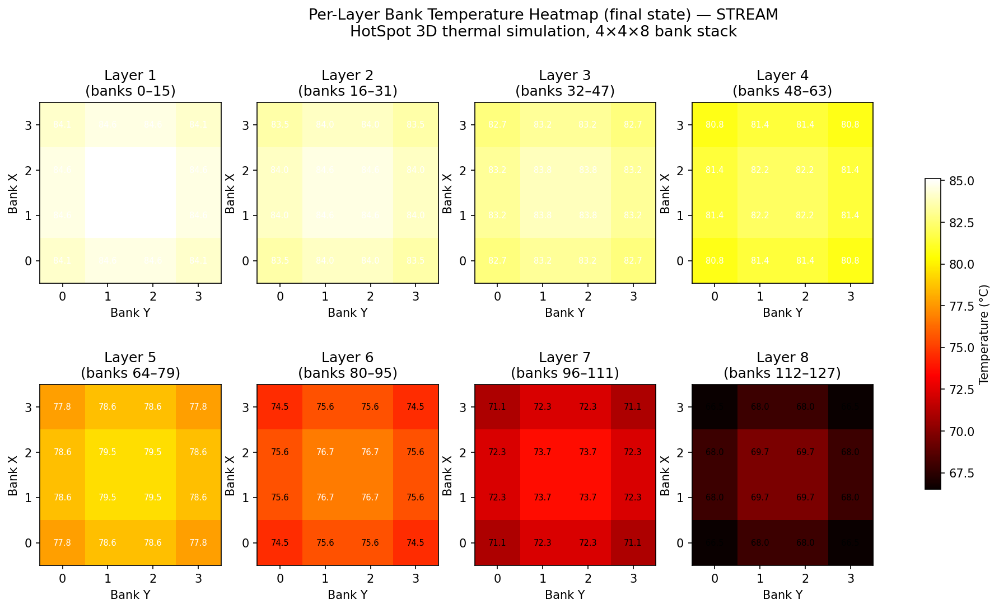
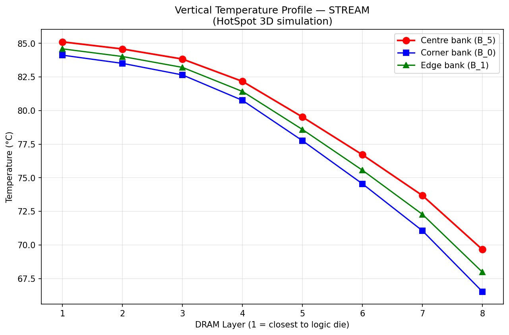
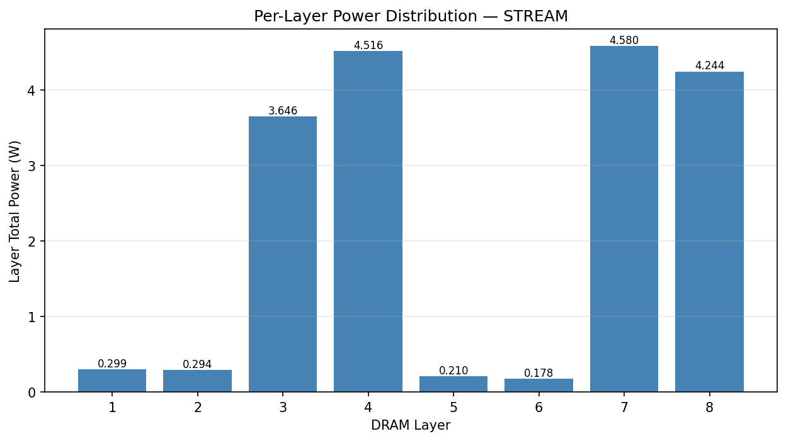

# HBM Thermal Analysis Report — STREAM Benchmark

## Pipeline Description

This report presents results from the **full closed-loop thermal management
pipeline** for HBM (High Bandwidth Memory) simulation:

```
Benchmark Workload → HBM Power Model → HotSpot 3D Thermal Simulator → DTM Policy → (feedback loop)
```

- **Power model**: Realistic HBM2 model with 5 power components (dynamic R/W,
  activation/precharge, refresh, temperature-dependent leakage, logic-core)
- **Thermal simulator**: HotSpot with 3D grid model, 18-layer stack
  (mem_ctrl + 8×bank + TIM layers), secondary heat path
- **DTM policy**: Composite (throttling + DVFS + low-power mode)
- **Board config**: `3Dmem_16core`

## 1. Simulation Setup

| Parameter | Value |
|-----------|-------|
| Benchmark | stream |
| Iterations (sampling intervals) | 50 |
| Sampling interval | 1.0 ms |
| HBM banks | 128 (4×4×8) |
| Banks per layer | 16 |
| Bank static power (ref @ 45°C) | 20.0 mW |
| Logic core power | 35.0 mW |
| Leakage model | Exponential: P(T) = P_ref · exp(0.06·(T−45°C)) |
| Throttle threshold | 80 °C |
| Critical threshold | 85 °C |
| Wall-clock time | 8.4 s |

## 2. Thermal Results Summary

| Metric | Value |
|--------|-------|
| Peak bank temperature (all time) | 86.04 °C |
| Peak bank temperature (final) | 85.11 °C |
| Mean bank temperature (final) | 78.48 °C |
| Total stack power (final) | 17.966 W |
| Final frequency scale | 0.50 |
| Final voltage scale | 0.85 |
| DVFS triggered | Yes (step 2) |

## 3. Temperature Evolution



The upper plot shows peak and mean bank temperatures computed by **HotSpot**
over the simulation.  The lower plot shows the DVFS scaling factors applied
by the DTM policy in response to thermal events.

**Observation**: DVFS was triggered at step 2 when peak temperature crossed 80°C.  The frequency was reduced to 50% and voltage to 85%, which reduced power dissipation and helped contain temperature rise.

## 4. Power Consumption



Total HBM stack power including:
- Dynamic read/write energy (20.55 nJ/access from CACTI3DD)
- Row activation (3.2 nJ) and precharge (1.1 nJ) energy
- Background refresh power (3.55 nJ/cmd at t_REFI = 7.8 µs)
- Temperature-dependent leakage: P(T) = 20 mW · exp(0.06·(T − 45°C))
- Logic-core power: 35 mW/core (20 mW static + 15 mW dynamic)

## 5. Per-Layer Thermal Heatmaps



Final-state temperature distribution across all 8 DRAM layers, computed by
HotSpot's 3D grid thermal model.  Each heatmap shows the 4×4 bank grid.

**Key observations:**
- Layer 1 (closest to the logic die) is the hottest due to heat from the
  memory controller
- Temperature decreases toward layer 8 (closest to the heat sink)
- Centre banks are hotter than corner banks due to reduced lateral heat
  dissipation (HotSpot models lateral conduction within each layer)

## 6. Vertical Temperature Profile



Temperature of selected banks across the 8 DRAM layers.  The gradient
shows heat flowing from the logic die (layer 1) toward the heat sink
(layer 8).  Centre banks experience higher temperatures than corner/edge
banks at every layer.

## 7. Per-Layer Power Distribution



Total power dissipated in each DRAM layer.
Since the stream workload has relatively uniform access distribution, power is nearly equal across layers.  Differences arise from temperature-dependent leakage — hotter layers (closer to the logic die) have higher leakage.

## 8. Power Model Details

The HBM power model (`pipeline/hbm_power_model.py`) includes five physically
grounded components:

1. **Dynamic read/write power**: Energy per access (20.55 nJ from CACTI3DD
   modelling of HBM2 bank) × access count / sampling interval.  Scaled by
   V²·f for DVFS.
2. **Activation/precharge power**: Each access implies a row open (3.2 nJ)
   and close (1.1 nJ).  This is separate from the column access energy.
3. **Refresh power**: Background refresh at t_REFI = 7.8 µs interval,
   3.55 nJ per refresh command.
4. **Static (leakage) power**: Temperature-dependent —
   P_leak(T) = 20 mW · exp(0.06 · (T − 45°C)).  This models sub-threshold
   leakage in 20 nm MOSFET technology, doubling every ~11.5°C.  The
   temperature-leakage feedback loop is closed: HotSpot temperatures are
   fed back to the power model each iteration.
5. **Logic-core power**: I/O PHY + DLL + ECC engine = 35 mW per core
   (20 mW static + 15 mW dynamic).

## 9. Thermal Model Details

The thermal simulation uses **HotSpot** (compiled from `hotspot_tool/`)
with the following configuration:

- **Model type**: 3D grid model (`-model_type grid -detailed_3D on`)
- **Stack type**: `3Dmem` (HBM memory stack)
- **Layer structure**: 18 layers from `config/hotspot/3Dmem_16core/mem.lcf`
  - Layer 0: Logic die (mem_ctrl) — 16 logic cores
  - Layers 1–17: Alternating DRAM bank layers and TIM (thermal interface material)
- **Secondary heat path**: Enabled (`-model_secondary 1`)
- **Ambient temperature**: 45°C (318.15 K)
- **Package**: Heat sink (400 W/(m·K)), heat spreader, PCB substrate

## 10. Benchmark Profile — STREAM

**STREAM (copy/triad)**: Sequential bandwidth-bound workload.
Sustains ~70% of peak HBM2 bandwidth (179 GB/s out of 256 GB/s).
Read:write ratio ≈ 2:1.  Uniform access across all 128 banks.
This represents the worst-case sustained thermal load for HBM.

---

*Generated by `run_full_pipeline.py` — COL812 GPU & HotSpot Project*
*Thermal simulation: HotSpot 3D grid model with 18-layer HBM stack*
